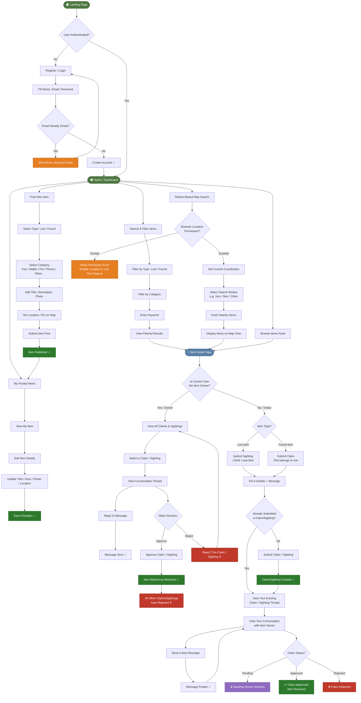

# Neighbor Lost & Found — User Flow

This document describes the user flow for the **Neighbor Lost & Found** application, a community platform for posting, searching, and resolving lost and found items.

---

## Flow Diagram

---

## Flow Summary

### Authentication

- New users register with name, email, and password
- Duplicate email addresses are caught and surfaced as an error
- Authenticated users land on the Home / Dashboard

### Posting an Item

- Users select whether the item is **Lost** or **Found**
- A category is chosen (e.g. Key, Wallet, Pet, Phone)
- Title, description, photo, and a map-pinned location are added
- The published item appears under **My Posted Items**
- Owners can edit item details at any time

### Searching for Items

- **Feed browsing** — scroll all active items
- **Filter search** — filter by type (Lost/Found), category, and keyword
- **Radius search** — uses browser geolocation to surface items within a chosen radius (1km, 5km, 10km, etc.) on a map view; requires location permission

### Item Detail Page

The Item Detail Page behaves differently depending on whether the viewer is the item owner or a visitor.

**Owner view**

- Sees all claims and sightings submitted for the item
- Can open any claim/sighting to read the conversation thread and reply
- Can **Approve** a claim/sighting → item is marked Resolved and all remaining claims/sightings are auto-rejected
- Can **Reject** individual claims/sightings and continue reviewing others

**Visitor view**

- On a _Lost_ item: can submit a **Sighting** ("I think I saw this!")
- On a _Found_ item: can submit a **Claim** ("This belongs to me!")
- Can only see their own claim/sighting thread — other people's submissions are hidden
- Can message the owner within the thread
- Claim status is visible as: ⏳ Pending · ✅ Approved · ❌ Rejected

### Claim & Sighting Resolution

1. A visitor submits a claim or sighting with an initial message
2. The owner reviews it and may exchange messages in the thread
3. The owner approves or rejects:
   - **Approve** → item resolved, all other open claims/sightings auto-rejected
   - **Reject** → that specific claim is closed; the owner continues reviewing others
