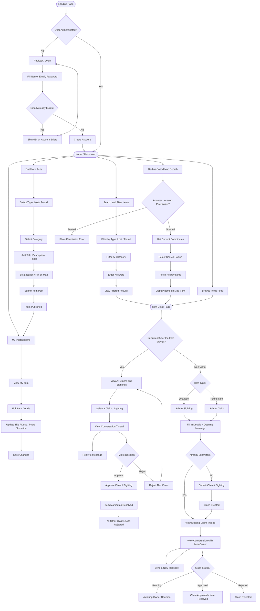

# Neighbour Lost & Found

A community platform for reporting, searching, and resolving lost and found items. Neighbours can post items they've lost or found, search by category or location, and communicate through a private claim/sighting thread to reunite items with their owners.

---

## Table of Contents

- [Project Overview](#project-overview)
- [Tech Stack](#tech-stack)
- [Project Structure](#project-structure)
- [Getting Started](#getting-started)
- [Environment Variables](#environment-variables)
- [Database Design](#database-design)
- [API Reference](#api-reference)
- [User Flow](#user-flow)
- [Seed Data](#seed-data)

---

## Project Overview

Neighbour Lost & Found is a full-stack web application with three services:

| Service    | Technology                   | Port                         |
| ---------- | ---------------------------- | ---------------------------- |
| `frontend` | Vue 3 + Vite + TypeScript    | `80` (Docker) / `5173` (dev) |
| `backend`  | FastAPI + SQLAlchemy (async) | `8000`                       |
| `db`       | PostgreSQL                   | `5432`                       |

**Core features:**

- Register and authenticate via session cookies
- Post lost or found items with photo, category, location, and map pin
- Browse and filter items by type, category, keyword, and geographic radius
- Submit a claim (on a found item) or sighting (on a lost item) with an opening message
- Private per-claim message thread between item owner and claimant
- Owner can approve or reject each claim; approving auto-rejects all other open claims and marks the item as resolved
- Radius-based map view powered by browser geolocation and Leaflet

---

## Tech Stack

**Backend**

- Python 3.14, FastAPI, SQLAlchemy 2 (async), asyncpg
- Alembic for migrations
- Argon2 password hashing, SHA-256 session tokens
- Pydantic v2 for request/response validation

**Frontend**

- Vue 3 (Composition API), TypeScript, Vite
- Pinia for state management
- Vue Router 4
- Tailwind CSS + shadcn-vue component library
- Leaflet for interactive maps
- Axios for HTTP

**Infrastructure**

- Docker + Docker Compose
- PostgreSQL with persistent named volume
- Nginx for frontend serving in production

---

## Project Structure

```
.
├── docker-compose.yaml
├── .env.example
├── backend/
│   ├── main.py                  # FastAPI app entry point
│   ├── pyproject.toml
│   ├── alembic/                 # Database migrations
│   ├── app/
│   │   ├── api/v1/
│   │   │   ├── endpoints/       # Route handlers
│   │   │   └── deps.py          # Dependency injection
│   │   ├── core/                # Config, DB, security, exceptions
│   │   ├── middleware/          # Logging, rate limiter, image size
│   │   ├── models/              # SQLAlchemy ORM models
│   │   ├── repositories/        # Database query layer
│   │   ├── schemas/             # Pydantic request/response schemas
│   │   └── services/            # Business logic layer
│   └── seed.py                  # Demo data seeder
└── frontend/
    └── src/
        ├── components/
        │   ├── items/           # Item cards, forms, maps, claims
        │   └── shared/          # Navbar, profile
        ├── stores/              # Pinia state (user, item, claim)
        ├── interfaces/          # TypeScript types
        ├── plugins/             # Axios setup
        └── router/              # Vue Router config
```

---

## Getting Started

### Prerequisites

- Docker and Docker Compose
- Node.js 20+ (for local frontend development)
- Python 3.14+ with `uv` (for local backend development)

### Running with Docker

```bash
# 1. Create the external volume (first time only)
docker volume create nlf_data

# 2. Copy and fill in environment files
cp .env.example .env
cp backend/.env.example backend/.env.docker

# 3. Start all services
docker compose up --build
```

The frontend will be available at `http://localhost` and the backend API at `http://localhost:8000`.

### Running Locally (Development)

**Backend**

```bash
cd backend
cp .env.example .env.local      # Fill in your local DB credentials
uv sync
uv run alembic upgrade head
uv run uvicorn main:app --reload --port 8000
```

**Frontend**

```bash
cd frontend
yarn
yarn dev
```

---

## Environment Variables

### Root `.env`

| Variable       | Description                                     | Example                        |
| -------------- | ----------------------------------------------- | ------------------------------ |
| `VITE_API_URL` | Backend URL passed to the frontend Docker build | `http://localhost:8000/api/v1` |

### `backend/.env.local` (local dev) / `backend/.env.docker` (Docker)

| Variable            | Description               | Example                          |
| ------------------- | ------------------------- | -------------------------------- |
| `BASE_URL`          | Full backend API base URL | `http://localhost:8000/api/v1`   |
| `POSTGRES_USER`     | PostgreSQL username       | `postgres`                       |
| `POSTGRES_PASSWORD` | PostgreSQL password       | `secretpass`                     |
| `POSTGRES_HOST`     | DB host                   | `localhost` or `nlf_db` (Docker) |
| `POSTGRES_PORT`     | DB port                   | `5432`                           |
| `POSTGRES_DB`       | Database name             | `nlf_db`                         |

---

## Database Design

### Entity Relationship Diagram

```
┌─────────────┐       ┌─────────────────┐       ┌─────────────────┐
│    users    │       │      items      │       │   item_photos   │
│─────────────│       │─────────────────│       │─────────────────│
│ id (PK)     │──┐    │ id (PK)         │       │ id (PK)         │
│ name        │  │    │ user_id (FK)    │◄──┐   │ item_id (FK, UQ)│
│ email (UQ)  │  └───►│ type            │   │   │ data (binary)   │
│ hashed_pw   │       │ title           │   │   │ mime_type       │
│ role        │       │ description     │   │   │ created_at      │
│ created_at  │       │ category        │   └───┴─────────────────┘
│ updated_at  │       │ date_occurred   │
└──────┬──────┘       │ lat / lng       │
       │              │ location_name   │
       │  ┌──────────►│ status          │
       │  │           │ resolved_at     │
       │  │           │ created_at      │
       │  │           │ updated_at      │
       │  │           └────────┬────────┘
       │  │                    │
       │  │           ┌────────▼────────┐
       │  │           │     claims      │
       │  │           │─────────────────│
       │  └───────────│ id (PK)         │
       │              │ item_id (FK)    │
       └─────────────►│ claimant_usr_id │
       │              │ status          │
       │              │ resolved_at     │
       │              │ created_at      │
       │              │ updated_at      │
       │              │ UQ(item_id,     │
       │              │   claimant_id)  │
       │              └────────┬────────┘
       │                       │
       │              ┌────────▼────────────┐
       │              │   claim_messages    │
       │              │─────────────────────│
       │              │ id (PK)             │
       │              │ claim_id (FK)       │
       └─────────────►│ sender_id (FK)      │
                      │ body (text)         │
                      │ created_at          │
                      └─────────────────────┘

┌─────────────────┐
│    sessions     │
│─────────────────│
│ id (PK)         │
│ session_token UQ│
│ user_id (FK)    │◄──── users.id
│ expires_at      │
│ created_at      │
└─────────────────┘
```

### Tables

**`users`**

| Column            | Type        | Notes             |
| ----------------- | ----------- | ----------------- |
| `id`              | integer     | PK, autoincrement |
| `name`            | varchar     | nullable          |
| `email`           | varchar     | unique, not null  |
| `hashed_password` | varchar     | argon2            |
| `role`            | enum        | `ADMIN`, `USER`   |
| `created_at`      | timestamptz |                   |
| `updated_at`      | timestamptz | nullable          |

**`sessions`**

| Column          | Type         | Notes                 |
| --------------- | ------------ | --------------------- |
| `id`            | integer      | PK                    |
| `session_token` | varchar(255) | unique, indexed       |
| `user_id`       | integer      | FK → users.id CASCADE |
| `expires_at`    | timestamptz  |                       |
| `created_at`    | timestamptz  |                       |

**`items`**

| Column          | Type         | Notes                                                                                       |
| --------------- | ------------ | ------------------------------------------------------------------------------------------- |
| `id`            | integer      | PK                                                                                          |
| `user_id`       | integer      | FK → users.id CASCADE                                                                       |
| `type`          | enum         | `lost`, `found`                                                                             |
| `title`         | varchar(255) |                                                                                             |
| `description`   | text         | nullable                                                                                    |
| `category`      | enum         | `electronics`, `pets`, `keys`, `wallet`, `bag`, `documents`, `clothing`, `jewelry`, `other` |
| `date_occurred` | date         | nullable                                                                                    |
| `lat`           | numeric(9,6) |                                                                                             |
| `lng`           | numeric(9,6) |                                                                                             |
| `location_name` | varchar(255) | nullable                                                                                    |
| `status`        | enum         | `open`, `claimed`, `resolved`, `removed`                                                    |
| `resolved_at`   | timestamptz  | nullable                                                                                    |
| `created_at`    | timestamptz  |                                                                                             |
| `updated_at`    | timestamptz  | nullable                                                                                    |

**`item_photos`**

| Column       | Type        | Notes                                   |
| ------------ | ----------- | --------------------------------------- |
| `id`         | integer     | PK                                      |
| `item_id`    | integer     | FK → items.id CASCADE, unique           |
| `data`       | bytea       | raw image bytes                         |
| `mime_type`  | varchar(50) | `image/jpeg`, `image/png`, `image/webp` |
| `created_at` | timestamptz |                                         |

**`claims`**

| Column             | Type              | Notes                             |
| ------------------ | ----------------- | --------------------------------- |
| `id`               | integer           | PK                                |
| `item_id`          | integer           | FK → items.id CASCADE             |
| `claimant_user_id` | integer           | FK → users.id CASCADE             |
| `status`           | enum              | `pending`, `approved`, `rejected` |
| `resolved_at`      | timestamptz       | nullable                          |
| `created_at`       | timestamptz       |                                   |
| `updated_at`       | timestamptz       | nullable                          |
| —                  | unique constraint | `(item_id, claimant_user_id)`     |

**`claim_messages`**

| Column       | Type        | Notes                  |
| ------------ | ----------- | ---------------------- |
| `id`         | integer     | PK                     |
| `claim_id`   | integer     | FK → claims.id CASCADE |
| `sender_id`  | integer     | FK → users.id CASCADE  |
| `body`       | text        |                        |
| `created_at` | timestamptz |                        |

---

## API Reference

All endpoints are prefixed with `/api/v1`. Authentication uses an HTTP-only `session_token` cookie set on login.

### Auth

#### `POST /auth/register`

Register a new user.

**Request**

```json
{
  "name": "Rahim Chowdhury",
  "email": "rahim@example.com",
  "password": "password123"
}
```

**Response `201`**

```json
{
  "success": true,
  "data": null,
  "message": "User registered successfully."
}
```

**Error `409`** — email already registered.

---

#### `POST /auth/login`

Authenticate and receive a session cookie.

**Request**

```json
{
  "email": "rahim@example.com",
  "password": "password123"
}
```

**Response `200`** — sets `session_token` HTTP-only cookie.

```json
{
  "success": true,
  "data": {
    "id": 1,
    "name": "Rahim Chowdhury",
    "email": "rahim@example.com",
    "role": "USER",
    "created_at": "2026-03-01T10:00:00Z",
    "updated_at": null
  },
  "message": "Login successful."
}
```

---

#### `POST /auth/logout`

Invalidate session and clear cookie. Requires the `session_token` cookie.

**Response `200`**

```json
{ "success": true, "data": null, "message": "Logout successful." }
```

---

#### `GET /auth/me`

Get the currently authenticated user.

**Response `200`** — same shape as login `data` object.

---

### Items

#### `POST /items/`

Create a new lost or found item. Requires authentication.

**Request**

```json
{
  "type": "lost",
  "title": "Black Leather Wallet",
  "description": "Lost near Shahbagh intersection. Contains NID card and two debit cards.",
  "category": "wallet",
  "date_occurred": "2026-03-08",
  "lat": 23.7386,
  "lng": 90.3961,
  "location_name": "Shahbagh, Dhaka"
}
```

**Response `201`**

```json
{
  "success": true,
  "data": {
    "id": 1,
    "user_id": 1,
    "type": "lost",
    "title": "Black Leather Wallet",
    "description": "Lost near Shahbagh intersection.",
    "category": "wallet",
    "date_occurred": "2026-03-08",
    "lat": 23.7386,
    "lng": 90.3961,
    "location_name": "Shahbagh, Dhaka",
    "status": "open",
    "photo_url": null,
    "resolved_at": null,
    "created_at": "2026-03-10T08:00:00Z",
    "updated_at": null,
    "user": { "id": 1, "name": "Rahim Chowdhury", "email": "rahim@example.com" }
  },
  "message": "Item created successfully."
}
```

---

#### `GET /items/`

Browse items with optional filters. All query parameters are optional.

**Query Parameters**

| Parameter  | Type              | Description                                             |
| ---------- | ----------------- | ------------------------------------------------------- |
| `type`     | `lost` \| `found` | Filter by item type                                     |
| `category` | enum              | Filter by category (see categories endpoint)            |
| `status`   | enum              | Filter by status (default excludes `removed`)           |
| `keyword`  | string            | Case-insensitive search in title and description        |
| `lat`      | float             | Origin latitude for radius search                       |
| `lng`      | float             | Origin longitude for radius search                      |
| `radius`   | float             | Search radius in km (max 100). Requires `lat` and `lng` |
| `offset`   | int               | Pagination offset (default `0`)                         |
| `limit`    | int               | Results per page (default `20`, max `100`)              |

**Example — keyword + type filter**

```
GET /api/v1/items/?type=lost&keyword=wallet&limit=10
```

**Example — radius search (returns items within 5 km, sorted by distance)**

```
GET /api/v1/items/?lat=23.7386&lng=90.3961&radius=5
```

**Response `200`**

```json
{
  "success": true,
  "data": {
    "items": [
      {
        "id": 1,
        "user_id": 1,
        "type": "lost",
        "title": "Black Leather Wallet",
        "category": "wallet",
        "lat": 23.7386,
        "lng": 90.3961,
        "location_name": "Shahbagh, Dhaka",
        "status": "open",
        "photo_url": "http://localhost:8000/api/v1/items/1/photo",
        "created_at": "2026-03-10T08:00:00Z",
        "distance_km": 0.312
      }
    ],
    "total": 1,
    "page": 1,
    "total_pages": 1,
    "offset": 0,
    "limit": 20,
    "has_next": false,
    "has_prev": false
  },
  "message": "Items retrieved successfully."
}
```

> `distance_km` is only present when `lat`/`lng` are supplied. Results are sorted by distance ascending when radius search is active.

---

#### `GET /items/me`

List all items posted by the authenticated user. No pagination.

**Response `200`** — array of item list objects (same shape as items in the paginated response above).

---

#### `GET /items/categories`

List all valid item categories.

**Response `200`**

```json
{
  "success": true,
  "data": [
    "electronics",
    "pets",
    "keys",
    "wallet",
    "bag",
    "documents",
    "clothing",
    "jewelry",
    "other"
  ],
  "message": "Available categories retrieved successfully."
}
```

---

#### `GET /items/{item_id}`

Fetch a single item with full details including owner info.

**Response `200`** — full `ItemResponse` object (see POST response shape).

**Error `404`** — item not found.

---

#### `PATCH /items/{item_id}`

Update an item. Only the item owner can update. All fields are optional.

**Request**

```json
{
  "title": "Updated Title",
  "description": "Updated description",
  "category": "electronics",
  "status": "resolved",
  "lat": 23.74,
  "lng": 90.39,
  "location_name": "New Location, Dhaka"
}
```

**Response `200`** — updated `ItemResponse`.

**Error `403`** — not the item owner.
**Error `404`** — item not found.

---

#### `DELETE /items/{item_id}`

Soft-delete an item (sets status to `removed`). Owner only.

**Response `200`**

```json
{ "success": true, "data": null, "message": "Item removed successfully." }
```

---

### Item Photos

#### `GET /items/{item_id}/photo`

Stream the item photo directly as an image (not JSON).

**Response** — raw image bytes with the appropriate `Content-Type` header.

**Error `404`** — no photo exists for this item.

---

#### `PUT /items/{item_id}/photo`

Upload or replace the photo for an item. Owner only. Accepts `multipart/form-data`.

**Constraints**

- Allowed types: `image/jpeg`, `image/png`, `image/webp`
- Max file size: 5 MB
- Uploading replaces any existing photo automatically

**Request** — `multipart/form-data` with field name `file`.

**Response `200`**

```json
{
  "success": true,
  "data": { "id": 1, "item_id": 1, "created_at": "2026-03-10T08:00:00Z" },
  "message": "Photo uploaded successfully."
}
```

**Error `400`** — invalid file type or size exceeded.
**Error `403`** — not the item owner.

---

#### `DELETE /items/{item_id}/photo`

Remove the photo for an item. Owner only.

**Response `200`**

```json
{ "success": true, "data": null, "message": "Photo deleted successfully." }
```

---

### Claims & Sightings

#### `POST /items/{item_id}/claim`

Submit a claim (on a found item) or sighting (on a lost item). Requires authentication.

**Business rules enforced**

- Item must have status `open`
- A user cannot claim their own item
- One claim per user per item (enforced by unique constraint)
- No new claims accepted once one is already approved

**Request**

```json
{
  "opening_message": "Hi, I believe this wallet is mine. The BRAC Bank card inside ends in 4821."
}
```

**Response `201`**

```json
{
  "success": true,
  "data": {
    "id": 1,
    "item_id": 1,
    "claimant_user_id": 2,
    "status": "pending",
    "resolved_at": null,
    "created_at": "2026-03-10T09:00:00Z",
    "updated_at": null,
    "claimant": {
      "id": 2,
      "name": "Nadia Islam",
      "email": "nadia@example.com"
    },
    "item": { "id": 1, "title": "Black Leather Wallet" },
    "messages": [
      {
        "id": 1,
        "claim_id": 1,
        "sender_id": 2,
        "body": "Hi, I believe this wallet is mine. The BRAC Bank card inside ends in 4821.",
        "created_at": "2026-03-10T09:00:00Z",
        "sender": {
          "id": 2,
          "name": "Nadia Islam",
          "email": "nadia@example.com"
        }
      }
    ]
  },
  "message": "Claim submitted successfully."
}
```

**Error `400`** — item not open, already claimed, user is the owner, or duplicate claim.

---

#### `GET /items/{item_id}/claims`

Get claims for an item. Response shape differs by role.

- **Item owner** — returns an array of all claims with claimant info and last message preview.
- **Claimant** — returns their own single claim object (no visibility into other claims).
- **No claim yet** — returns an empty array.

**Response `200` — owner view**

```json
{
  "success": true,
  "data": [
    {
      "id": 1,
      "item_id": 1,
      "claimant_user_id": 2,
      "status": "pending",
      "created_at": "2026-03-10T09:00:00Z",
      "claimant": {
        "id": 2,
        "name": "Nadia Islam",
        "email": "nadia@example.com"
      },
      "item": { "id": 1, "title": "Black Leather Wallet" },
      "last_message": {
        "id": 3,
        "claim_id": 1,
        "sender_id": 1,
        "body": "Can you describe the inside lining?",
        "created_at": "2026-03-10T10:30:00Z",
        "sender": {
          "id": 1,
          "name": "Rahim Chowdhury",
          "email": "rahim@example.com"
        }
      }
    }
  ],
  "message": "Claims retrieved successfully."
}
```

**Response `200` — claimant view**

```json
{
  "success": true,
  "data": {
    "id": 1,
    "item_id": 1,
    "status": "pending",
    "created_at": "2026-03-10T09:00:00Z",
    "updated_at": null,
    "item": { "id": 1, "title": "Black Leather Wallet" },
    "messages": [ ... ]
  },
  "message": "Claims retrieved successfully."
}
```

---

#### `GET /items/claims/{claim_id}/messages`

Fetch the full message thread for a claim in chronological order. Only the claimant or item owner can read.

**Response `200`**

```json
{
  "success": true,
  "data": [
    {
      "id": 1,
      "claim_id": 1,
      "sender_id": 2,
      "body": "Hi, I believe this wallet is mine.",
      "created_at": "2026-03-10T09:00:00Z",
      "sender": { "id": 2, "name": "Nadia Islam", "email": "nadia@example.com" }
    },
    {
      "id": 2,
      "claim_id": 1,
      "sender_id": 1,
      "body": "Can you describe the inside lining colour?",
      "created_at": "2026-03-10T09:15:00Z",
      "sender": {
        "id": 1,
        "name": "Rahim Chowdhury",
        "email": "rahim@example.com"
      }
    }
  ],
  "message": "Messages retrieved successfully."
}
```

**Error `403`** — user is neither the claimant nor the item owner.

---

#### `POST /items/claims/{claim_id}/messages`

Send a message in a claim thread. Only the claimant or item owner can send. Thread is locked once the claim is no longer `pending`.

**Request**

```json
{ "body": "The inside lining is dark red/maroon." }
```

**Response `201`** — the new `ClaimMessageResponse` object (same shape as messages above).

**Error `400`** — claim is already resolved or rejected.
**Error `403`** — user is not a participant in this claim.

---

#### `PATCH /items/claims/{claim_id}/resolve`

Approve or reject a claim. Item owner only.

**Side effects of approval**

- Item status is set to `claimed`
- All other `pending` claims on the same item are automatically set to `rejected`

**Side effects of rejection**

- Item status is reset to `open`

**Request**

```json
{ "status": "approved" }
```

or

```json
{ "status": "rejected" }
```

**Response `200`**

```json
{
  "success": true,
  "data": {
    "id": 1,
    "item_id": 1,
    "claimant_user_id": 2,
    "status": "approved",
    "resolved_at": "2026-03-10T11:00:00Z",
    "created_at": "2026-03-10T09:00:00Z",
    "updated_at": "2026-03-10T11:00:00Z",
    "claimant": { "id": 2, "name": "Nadia Islam", "email": "nadia@example.com" },
    "item": { "id": 1, "title": "Black Leather Wallet" },
    "messages": [ ... ]
  },
  "message": "Claim approved successfully."
}
```

**Error `400`** — claim is not in `pending` status.
**Error `403`** — not the item owner.

---

### Users

#### `GET /users/`

List all users. Supports `offset` and `limit` query params.

#### `GET /users/{user_id}`

Fetch a single user by ID. Returns `404` if not found.

#### `PATCH /users/{user_id}`

Update a user's name or email. Returns `400` if the new email is already taken.

**Request**

```json
{ "name": "Rahim Updated", "email": "new@example.com" }
```

**Response `200`** — updated `UserResponse` object.

#### `DELETE /users/{user_id}`

Delete a user account permanently.

---

### Health Check

#### `GET /health`

```json
{ "status": "ok" }
```

---

## User Flow



---

## Seed Data

A seed script is provided to populate the database with realistic demo data by calling the live API endpoints in sequence.

```bash
# Default — points to http://localhost:8080/api/v1
cd backend
python seed.py

# Custom base URL
BASE_URL=http://localhost:8000/api/v1 python seed.py

# With photos — place images in ./seed_photos/ before running
# Supported filenames: wallet, phone, dog, keys, school_bag,
#   nid_card, airpods, bracelet, glasses, jacket, passport, helmet
# Supported formats: .jpg, .jpeg, .png, .webp
PHOTOS_DIR=./seed_photos python seed.py
```

The seed script creates:

| Resource | Count | Details                                                |
| -------- | ----- | ------------------------------------------------------ |
| Users    | 4     | Rahim, Nadia, Karim, Suma                              |
| Items    | 12    | Mix of lost & found across Dhaka locations             |
| Claims   | 4     | 1 approved, 1 rejected, 2 pending with message threads |

**Demo credentials** — all accounts share the same password:

| Name            | Email          | Password    |
| --------------- | -------------- | ----------- |
| Rahim Chowdhury | rahim@demo.com | password123 |
| Nadia Islam     | nadia@demo.com | password123 |
| Karim Hossain   | karim@demo.com | password123 |
| Suma Begum      | suma@demo.com  | password123 |
