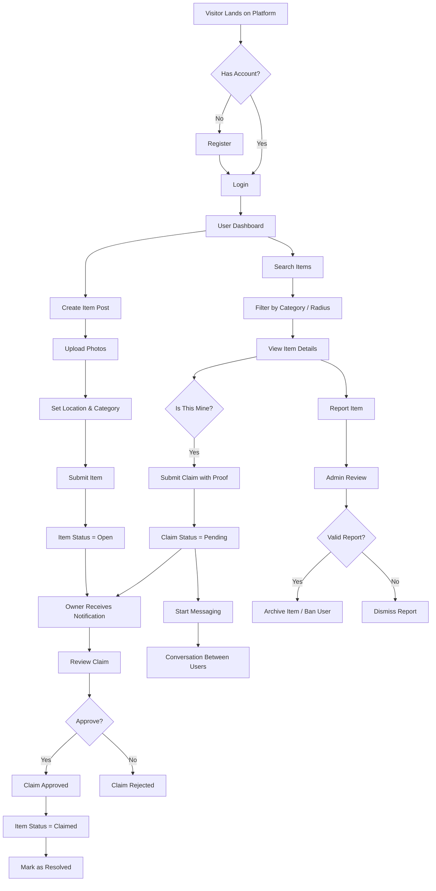
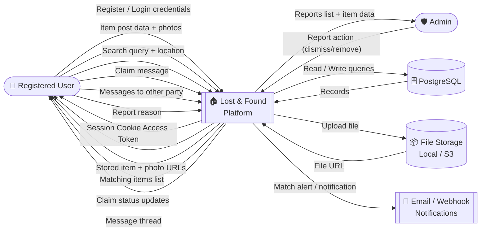
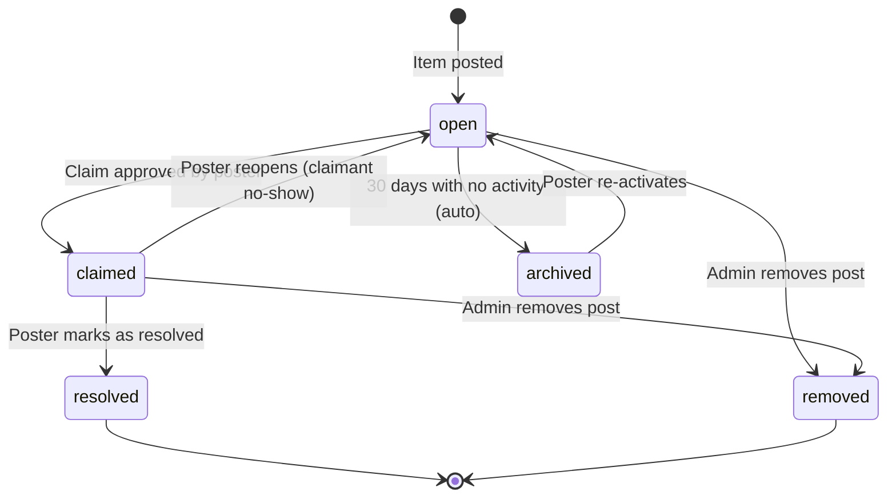
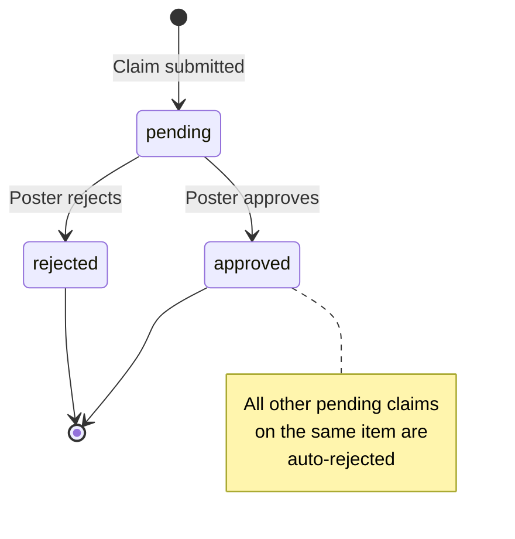

# 📊 Diagrams — Neighborhood Lost-and-Found

---

## 1. User Flow Diagram

This diagram traces every journey a user can take through the system — from registration through posting, searching, claiming, and resolution.

---

## 2. Data Flow Diagram (DFD) — Level 0 (Context Diagram)

High-level view of who interacts with the system and what data flows in and out.

---

## 3. Item Status State Machine

Tracks all valid transitions for an item through its lifecycle.

---

## 4. Claim Status State Machine

